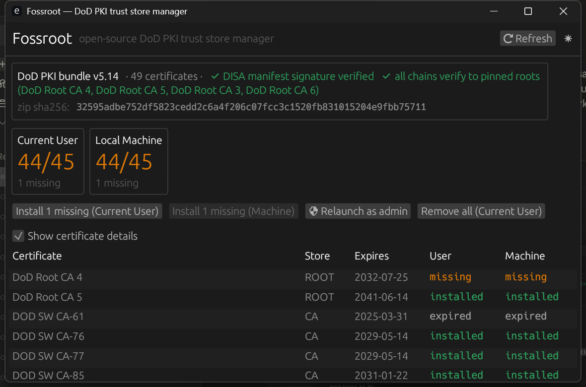
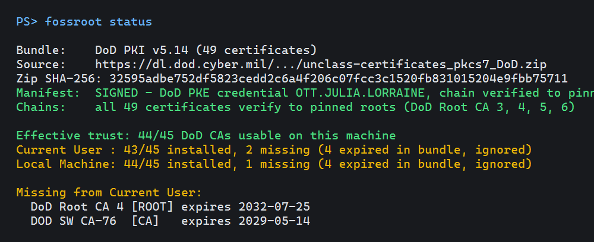

# Fossroot

**Open-source, single-binary manager for DoD PKI CA certificate trust stores.**
A modern, auditable replacement for DISA's InstallRoot utility.



> ⚠️ **Unofficial community tool.** Fossroot is not affiliated with, endorsed by, or
> supported by the U.S. Department of War, DISA, or any government agency.
> "InstallRoot" is DISA's product; Fossroot is an independent open-source
> reimplementation of the same end-user need.

## The suite

Fossroot is growing into a small suite of CAC/PKI tools that share one core and
one local native agent:

| Component | What it is | Status |
|---|---|---|
| `fossroot` | The trust-store manager (this README) | Shipped |
| `fossroot-core` | Shared Rust engine: fetch, verify, diff, trust stores | Shipped |
| `fossroot-agent` | Native-messaging host bridging the browser to the local machine | Working |
| [FossRoot CAC Reset](extensions/cac-reset/) | Chrome/Edge extension: fixes the "must restart browser to reset my CAC" problem (+ trust status) | Working |
| FossRoot Signer | Chrome/Edge extension: sign a PDF (e.g. DAF 2096) with your CAC, no Adobe Reader | Planned |

The agent is the keystone: browsers deliberately sandbox away from smart cards
and the OS trust store, so the planned browser-session helper and in-browser CAC
document signing both ride on this bridge rather than trying (and failing) to do
it in pure JavaScript.

## What it does

Accessing DoW websites (OWA, myPay, MilConnect, …) from a personal computer
requires the DoD PKI root and intermediate CA certificates in your machine's
trust store. DISA's InstallRoot tool does this, but it is Windows-only, closed
source, and frozen at v5.6 (2024). Fossroot runs on Windows, macOS, and Linux,
handles the DoD, ECA, JITC, and WCF bundle groups, and:

- **Fetches the latest official bundle** live from DISA's distribution point
  (`dl.dod.cyber.mil`) — Fossroot never ships certificates of its own.
- **Cryptographically verifies everything before touching your machine**:
  - the bundle's DISA-signed CMS checksum manifest is verified back to DoD
    root CAs whose SHA-256 fingerprints are **pinned in the source code**;
  - every certificate in the bundle must chain — with real signature
    verification (RSA & ECDSA) — to a pinned DoD root, or the bundle is
    rejected outright.
- **Shows you a full diff before any change**: what's installed, what's
  missing, what's expired, and which stale DoD CAs should be pruned.
- **Installs without admin** by default (per-user trust store; Windows shows
  its own confirmation for each root), or machine-wide from an elevated shell.
- **Uninstalls completely** — it removes exactly the certificates in the DISA
  bundle, nothing else, and leaves no other trace on your system.

## Why trust it?

You shouldn't trust *any* third-party root-CA installer blindly — including
this one. Fossroot's answer:

1. **100% open source** — every line that touches your trust store is in this
   repo, in memory-safe Rust.
2. **Never bundles the certificates it installs** — those always come live from
   DISA. The *only* certificate material Fossroot ships is the four DoD **root**
   CAs, embedded purely as verification anchors and pinned by fingerprint in
   [`verify.rs`](crates/fossroot-core/src/verify.rs) (each checked against its
   pin at load). DISA signs every group's manifest with a DoD PKE credential, so
   those four anchors transitively verify the DoD, ECA, JITC, and WCF bundles.
3. **Fail-closed verification** — if the manifest signature, a checksum, or a
   single chain fails to verify, nothing is installed.
4. **Single portable binary** — no installer, no services, no telemetry, no
   config files. Delete the exe and it's gone.

## Usage

```text
fossroot                 # GUI
fossroot status          # read-only: verification + coverage report
fossroot status --json   # machine-readable
fossroot install         # install missing certs (current user, no admin)
fossroot install --machine --prune   # machine-wide + remove stale DoD CAs (elevated)
fossroot remove          # uninstall everything the bundle manages
fossroot export --out d: # dump .cer files + PEM chain (for Firefox, WSL, etc.)
fossroot ... --offline bundle.zip    # air-gapped: use a hand-carried bundle
fossroot --group eca status          # ECA / JITC / WCF bundle groups
```



The same verification runs whether you use the GUI or the CLI — the diff you see
is exactly what will change, and nothing is written until you confirm.

## Building

```bash
cargo build --release
```

Requires stable Rust. The result is a single self-contained executable.

## Platforms

| Platform | Trust store | Status |
|---|---|---|
| Windows | CryptoAPI (`ROOT`/`CA`, user & machine) | Implemented, runtime-verified |
| Linux | `update-ca-certificates` (Debian) / `update-ca-trust` (RHEL) | Implemented, CI-compiled; runtime pending hardware test |
| macOS | Security.framework keychain + trust settings | Implemented, CI-compiled; runtime pending hardware test |

All three build, test, clippy, and fmt on every push via the CI matrix.

## Roadmap

- Firefox/Thunderbird NSS profile support
- Java keystore support
- Runtime validation of the Linux/macOS backends on real hardware
- Code signing (Windows Authenticode/Azure Trusted Signing, macOS notarization)
  and package-manager distribution (winget, Homebrew tap)

Done: ✅ ECA / JITC / WCF bundle groups · ✅ macOS & Linux trust-store backends.

## License

Dual-licensed under [MIT](LICENSE-MIT) or [Apache-2.0](LICENSE-APACHE), at your option.
